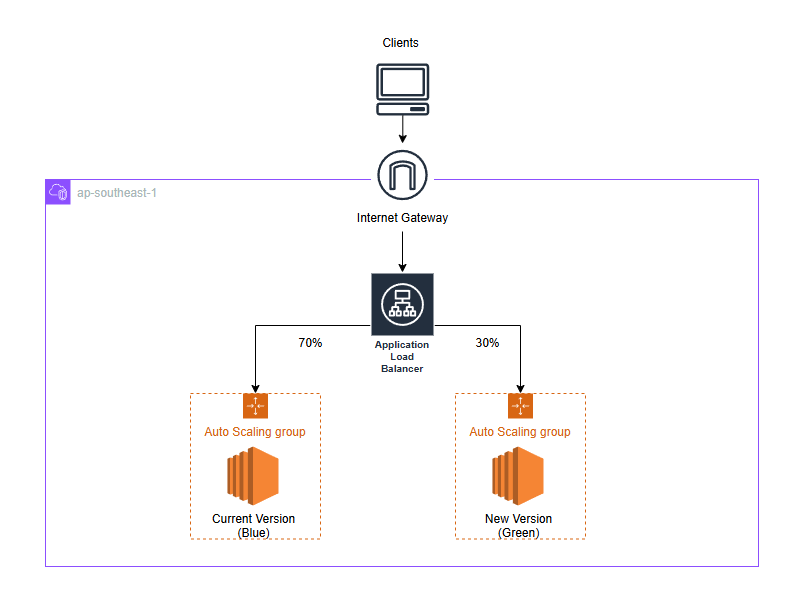
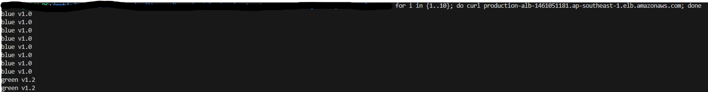

# Blue-Green-deployment
This project demonstrates blue/green deployment using Terraform for cloud infrastructure provisioning. 
- Blue-Green deployment is a release strategy that minimizes downtime and risk during application updates. It involves maintaining two identical production environments ("Blue" and "Green"). 
- A blue environment is the current application version and green environment is the new version.
- Application Load Balancer is used to direct traffic in a way the green environment is gradually released to clients. This reduces deployment risk by simplfying rollback process if deployment fails.
- Once testing has been completed on the green environment, live application traffic is directed to the green environment and the blue environment is deprecated.

# Architecture Diagram


Above architecture diagram illustrates Blue-Green deployment in an AWS environment. The diagram consist of the following key components:

1. Internet Gateway:  
   The entry point for traffic from the internet into Virtual Private Cloud (VPC)

2. Application Load Balancer (ALB):
   ALB acts as a traffic management which distributes incoming requests between two Auto Scaling Groups based on weightage set. The ALB is located in public subnet such that it can receive traffic from the internet

3. Auto Scaling Group (ASG):
   There are two ASGs hosting Blue (current) and Green (new) environment. The current traffic weightage is set 70% to Blue, 30% to Green. The ASGs will scale the EC2s horizontally based on traffic volume.

4. Elastic Cloud Compute (EC2):
   The instance that runs the application. For this case the application is a static website page shows the name of the environment (Blue or Green)

In a nutshell, Clients send requests to the application. The requests enter the VPC through the Internet Gateway. The ALB receives the requests and distribute them according to the weightage and direct to the EC2s. Users will receive either Blue or Green website depending on the traffic directed.

# Terraform
For organizing resources and improve code readability, the code are split into multiple terraform files. The following are the file used for the projects and its purpose:


| Filename | Purpose |
|----------|----------|
|backend.tf | Stores a snapshot of the current state of the deployed resources, including the configuration and dependencies. This allows Terraform to track changes and prevent accidental drifts between your desired infrastructure configuration and the actual deployed resources|
|provider.tf| Informs Terraform which terraform and AWS version to use|
|main.tf | Code to provision Application Load Balancer and Web Application Firewall|
|blue.tf & green.tf | Code to deploy EC2 & Auto-Scaling Group for blue and green environment respectively|
|variables.tf| Declare input variables for Terraform configurations|


# Deployment

To deploy, execute the following terraform commands:

```terraform
terraform init   
terrform validate
terraform plan
terraform apply --auto-approve
```

Once the execution are complete, curl command is used on the DNS of the ALB to check the content of the deployed websites 10 times. 


```Bash
for i in {1..10}; do curl production-alb-1461051181.ap-southeast-1.elb.amazonaws.com; done
```



As shown, out of 10 requests, 2 of it are from the new version which is the approximate weightage settings in the ALB setting. This shows that the blue-green deployment has been sucessfuly deployed.

To remove the deployed resources, execute:
```terraform
terraform destroy --auto-approve
```